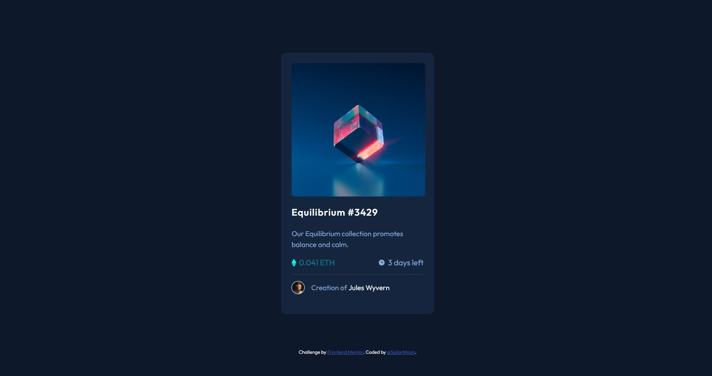

# Frontend Mentor - NFT preview card component solution

This is a solution to the [NFT preview card component challenge on Frontend Mentor](https://www.frontendmentor.io/challenges/nft-preview-card-component-SbdUL_w0U). Frontend Mentor challenges help you improve your coding skills by building realistic projects.

## Table of contents

- [Overview](#overview)
  - [The challenge](#the-challenge)
  - [Screenshot](#screenshot)
  - [Links](#links)
- [My process](#my-process)
  - [Built with](#built-with)
  - [What I learned](#what-i-learned)
- [Author](#author)
- [Acknowledgments](#acknowledgments)

## Overview

### The challenge

Users should be able to:

- View the optimal layout depending on their device's screen size
- See hover states for interactive elements

### Screenshot

### Links

- Solution URL: [https://github.com/SailorMoonDev/frontendMentorChallenges_nft-preview-card-component_Newbie-HTML-CSS-](https://github.com/SailorMoonDev/frontendMentorChallenges_nft-preview-card-component_Newbie-HTML-CSS-)
- Live Site URL: [https://sailormoondev.github.io/frontendMentorChallenges_nft-preview-card-component_Newbie-HTML-CSS-/](https://sailormoondev.github.io/frontendMentorChallenges_nft-preview-card-component_Newbie-HTML-CSS-/)

## My process

### Built with

- Semantic HTML5 markup
- CSS custom properties
- Flexbox
- Mobile-first workflow

### What I learned

I am just starting out in the world of web development. I'm taking my first steps with HTML and CSS. Knowing learning resources, the FrontMentor challenges have been a great help.

## Author

- Frontend Mentor - [@bonitawendy89](https://www.frontendmentor.io/profile/bonitawendy89)

## Acknowledgments

Thanks to - [@CodingTube](https://www.youtube.com/@CodingTube)
